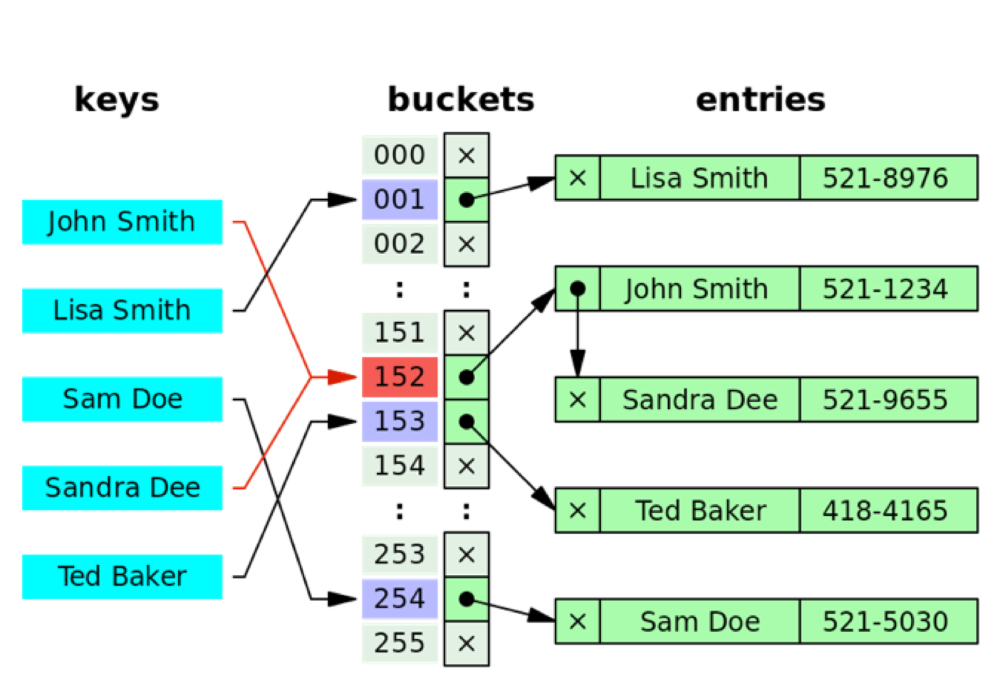

## Hashmaps-Hashtables

HashMaps and HashTables are data structures that store key-value pairs and provide efficient lookup, insertion, and deletion operations. They use a hashing function to map keys to indices in an underlying array, allowing for average-case O(1) time complexity for these operations.

### Key Concepts
* Hashing Function:

A function that takes a key and computes an index (hash code) where the corresponding value should be stored.

A good hashing function distributes keys uniformly across the array to minimize collisions.

* Collision:

Occurs when two different keys hash to the same index.

#### Common collision resolution techniques:

* Chaining: Store multiple key-value pairs in the same index using a linked list or other data structure.

* Open Addressing: Find another available slot in the array (e.g., linear probing, quadratic probing).

* Load Factor:

The ratio of the number of elements stored to the size of the array.

A high load factor increases the likelihood of collisions, so resizing (rehashing) is often performed when the load factor exceeds a threshold.

#### Operations on HashMaps and HashTables
* Insert (Put):

Add a key-value pair to the map/table.

* Lookup (Get):

Retrieve the value associated with a key.

* Delete (Remove):

Remove a key-value pair from the map/table.

* ContainsKey:

Check if a key exists in the map/table.

* Size:

Return the number of key-value pairs stored.

#### Applications of HashMaps and HashTables
1. Database Indexing:

* Hash-based indexing is used to quickly retrieve records.

2. Caching:

* HashMaps are used in caching mechanisms (e.g., memoization).

3. Count Frequency:

* Counting the frequency of elements in a dataset.

4. Symbol Tables:

* Used in compilers to store variables and their attributes.

5. Routing Tables:

* Used in networking to map IP addresses to routes.

#### key Features

* HashMaps and HashTables provide fast lookups, insertions, and deletions.

* Collisions are handled using chaining or open addressing.

* HashMaps are more commonly used than HashTables due to better performance and flexibility.
